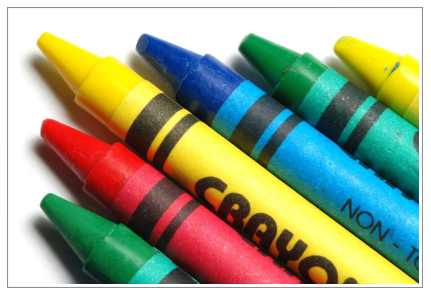
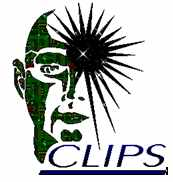

---
layout: guide 
lang:   es
ref:    c640ug03

manualcode: c640ug

title:      'CLIPS 6.4 Guía de Usuario'
headtitle:  'Adición de detalles'
shorttitle: 'Giarratano, J.C. (2021)'

toc:    true 
author: 'Dr. Giarratano, Joseph C.' 
date:   '2021-04-09 03:17:40:49:44 +0100' 

keywords: 
  - 'CLIPS' 
  - 'COOL' 

chapter: 3
--- 

{:width="200px"  border="0px" } 
{:width="128px"  border="0px" } 

# Capítulo 3: Adición de detalles

## 3.1. Pare y siga

## 3.2. Dar un paseo

## 3.3. Una Cuestión de Estrategia

## 3.4. Dame defectos

## 3.5. Eliminación selectiva

## 3.6. ¡Míralo!

## 3.7. Un buen partido

## 3.1. Otras características

Accesos [^1], [^java], [^jade], [^migra17], [^openJDK], [^cool]. 

## Bibliografía

[^1]: CLIPS Rule Based Programming Language Files. Expert System Tool. Gary, Riley D. (Ed. 2022). URL: https://sourceforge.net/projects/clipsrules/.

[^java]: ORACLE Java 17 is the latest long-term support (LTS) release under Java's six-month release cadence and is the result of extensive collaboration between Oracle engineers and other members of the worldwide Java developer community via the OpenJDK Community and the Java Community Process (JCP). Verificada con la versioón jdk-17.0.3.1 (junio, 2022). https://www.oracle.com/news/announcement/oracle-releases-java-17-2021-09-14/.

[^jade]:    JADE Platform. jade - Revision 6867: /trunk. https://jade.tilab.com/svn/jade/trunk/  Login/passwod: jade/jade. Version 4.5.4 (abril, 2022).

[^migra17]: Significant Changes in JDK 17 Release. Notes for additional descriptions of the new features and enhancements, and API specification in JDK 17. Updates in Java SE 17 and JDK 17: https://docs.oracle.com/en/java/javase/17/migrate/significant-changes-jdk-release.html

[^openJDK]: OpenJDK 17 is the open-source reference implementation of version 17 of the Java SE Platform, as specified by by JSR 390 in the Java Community Process. JDK 17 reached General Availability on 14 September 2021. URL for OpenJDK-11 is: https://openjdk.java.net/projects/jdk/11/. URL for OpenJDK-17 is: https://openjdk.java.net/projects/jdk/17/.

[^cool]: COOL is the acronym for CLIPS Object Oriented Language.

